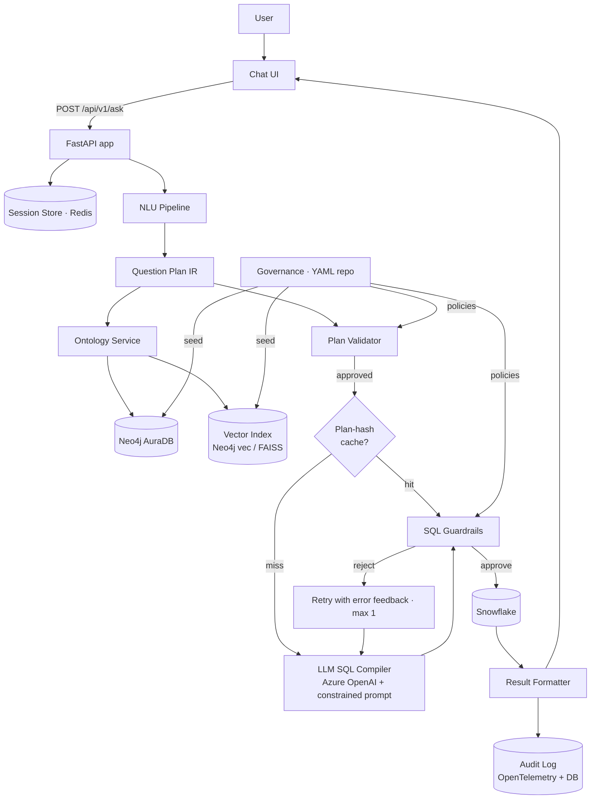
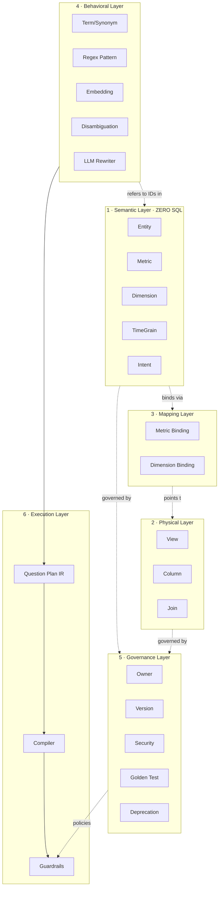
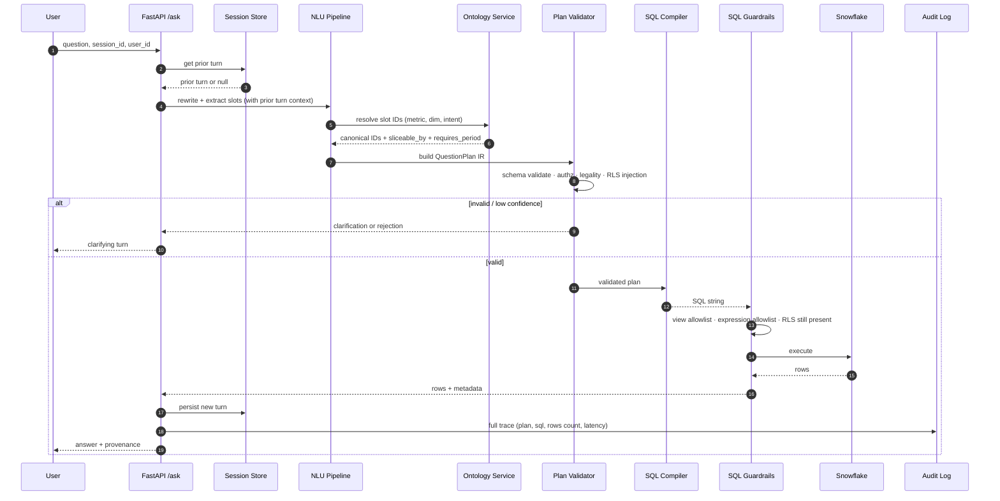
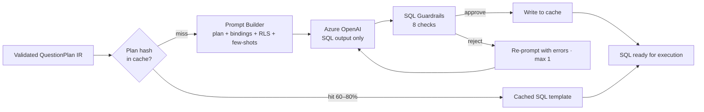
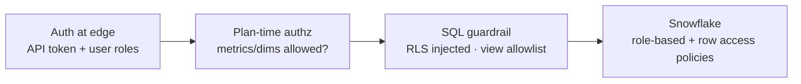
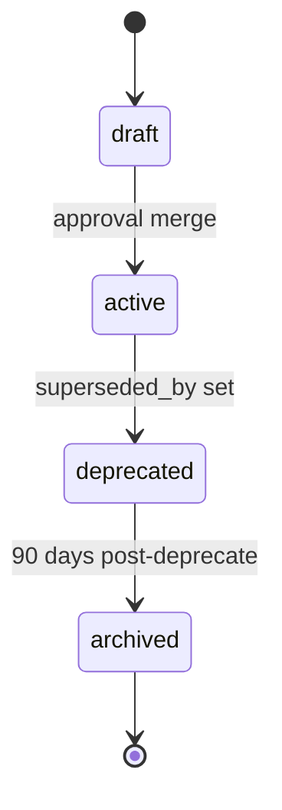
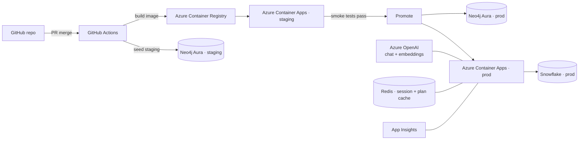
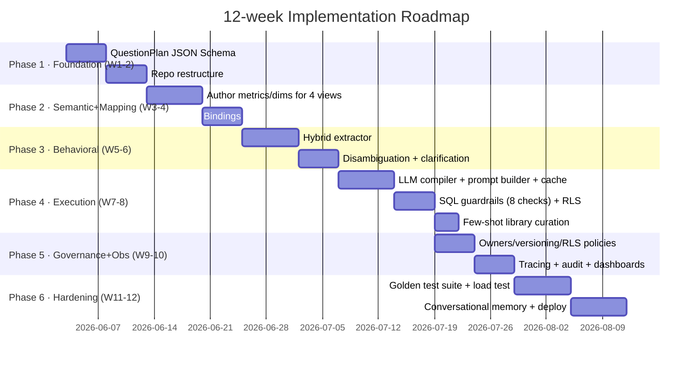

# Solution Design — Unifi KPI Ontology-Enabled Chatbot

## Cover

| | |
|---|---|
| **Project** | Unifi KPI Ontology-Enabled Chatbot |
| **Version** | 2.0 (Ontology Refactor) |
| **Status** | Design — pending implementation |
| **Owner** | Data Platform Team |
| **Audience** | Engineers, Data Architects, Platform/SRE, Security, Business KPI owners |

## Table of Contents

1. Executive Summary
2. Problem Statement
3. Goals & Non-Goals
4. High-Level Architecture
5. The Six Layers (detailed)
6. Question Plan IR (the spine)
7. Data Flow & Sequence
8. Neo4j Knowledge Graph Model
9. YAML Source-of-Truth Specification
10. SQL Generation Strategy (LLM-based compiler)
11. Security, RLS, and Authorization
12. Governance & Lifecycle
13. Observability, Tracing, Audit
14. Testing Strategy
15. Performance & Scalability
16. Failure Modes & Resilience
17. Deployment Topology
18. Risks, Open Questions, Decisions
19. Roadmap
20. Glossary

---

## 1. Executive Summary

The current chatbot treats KPIs as monolithic per-file recipes hardcoded in YAML. This works for ~7 KPIs but does not scale: every new question class (thresholds, ranking, comparisons, trends, drill-downs, follow-ups) requires editing every KPI file. The system also has no formal validation between intent extraction and SQL execution, no governance metadata on concepts, and no auditable trace of why a particular SQL was generated.

This document specifies a refactor to a **six-layer ontology-driven architecture** with:

- A **semantic layer** of metrics, dimensions, entities, time grains, and intents (no SQL).
- A **physical layer** describing Snowflake views, columns, joins.
- A **mapping layer** binding semantic concepts to physical artifacts.
- A **behavioral layer** translating natural language into structured slots (hybrid: regex + fuzzy + embeddings + LLM rewriter).
- A **governance layer** (owner, version, status, security, test coverage) as a first-class node, not a sidecar.
- An **execution layer** with a strict `QuestionPlan` JSON-schema-validated intermediate representation, an **LLM-based SQL compiler** with a plan-hash cache for determinism, an 8-check SQL guardrail layer, and audit logging.

The project ships in **12 weeks** across six 2-week phases, each independently deployable.

## 2. Problem Statement

### 2.1 Current state (v1.0)

- 7 KPIs in `ontology/kpis/*.yaml`, loaded into Neo4j as `:KPI` nodes with `:KPIStep` and `:Filter` children.
- Intent extraction in `core/intent_extractor.py` uses `rapidfuzz` partial-ratio against synonyms loaded from `terms.yaml`.
- Lookup is one Cypher per question fetching the recipe; SQL is generated by Azure OpenAI from the recipe.
- A simple validator checks for view allowlist; row-level security is partial.

### 2.2 Concrete gaps

| # | Gap | Symptom |
|---|---|---|
| G1 | KPI mis-routing on overlapping synonyms | "list of stations…attrition…" can route to "List Stations" |
| G2 | Numeric thresholds silently dropped | "more than 10%" never reaches SQL deterministically |
| G3 | No governed Top-N / ranking slot | "top 5" relies on LLM heuristics |
| G4 | No grouping intent slot | "by station" not declared anywhere |
| G5 | No conversational memory | "what about ATL?" can't reuse prior turn |
| G6 | No formal Question Plan IR | LLM gets raw question + raw recipe — non-deterministic |
| G7 | Operations layer absent | No catalog of supported intents (filter, rank, threshold, trend, compare) |
| G8 | Variant selection implicit | Two attrition KPIs share synonyms; resolution is luck |
| G9 | Phrasing brittleness | "headcount churn" doesn't match "attrition" — pure string overlap |
| G10 | Limited governance metadata | No owner, version, status, test coverage on most concepts |
| G11 | Audit trail incomplete | Cannot reconstruct "why did this question produce this SQL?" |
| G12 | RLS not first-class | Authorized stations passed at request time, not enforced as policy in plan |

### 2.3 Out-of-scope (this document)

- Frontend chat UI redesign.
- Snowflake schema changes (the views are taken as given).
- Migration of historical chat logs.

## 3. Goals & Non-Goals

### 3.1 Goals

1. **Composability**: any valid `(metric × dimensions × intent × period)` combination is queryable without authoring a new KPI file.
2. **Auditability**: every answer is reconstructable from a logged Question Plan + ontology snapshot version.
3. **Governance**: every concept has owner, version, status; deprecation is a status flip not a code change.
4. **Robustness to phrasing**: "headcount churn", "who's leaving", "attrition" all route correctly via embedding similarity.
5. **Security**: authorization filters always injected; views always allowlisted; no PII leakage by default.
6. **Conversational**: follow-up turns inherit slots from prior turn; clarification turns are first-class.
7. **Maintainability**: adding a new metric requires editing ≤ 2 files and zero Python code.

### 3.2 Non-goals

1. Free-form NL2SQL over arbitrary Snowflake schema. The ontology constrains what is queryable on purpose.
2. Replacing the LLM. The LLM remains in NLU and SQL composition; it operates *inside* ontology guardrails.
3. Real-time streaming queries. Batch/interactive only.

## 4. High-Level Architecture



### 4.1 Component responsibilities (one-line each)

| Component | Responsibility |
|---|---|
| Chat UI | Renders conversation, sends `(question, session_id, user_id)` |
| FastAPI app | HTTP edge, auth, rate limit |
| Session Store | Stores last `ConversationTurn` per session for follow-ups |
| NLU Pipeline | Question → slot extraction (regex + fuzzy + embedding + LLM rewriter) |
| Question Plan IR | Validated JSON object describing what to query |
| Ontology Service | Resolves slot IDs to Neo4j concepts; enforces sliceable_by, requires_period |
| Plan Validator | Authorizes (RLS), checks legality, normalizes |
| SQL Compiler | LLM (Azure OpenAI) generates SQL from QuestionPlan + bindings + few-shots; result cached by plan hash |
| Plan-hash Cache | Redis-backed `plan_hash → sql_template` cache; restores determinism and amortizes LLM cost |
| SQL Guardrails | 8-check parser-based validation (allowlist, RLS, completeness); retries LLM on rejection |
| Snowflake | Executes the SQL |
| Result Formatter | Shapes output (table, scalar, narrative) |
| Audit Log | Persists question + plan + SQL + rows + timing |
| Governance YAML repo | Source of truth; seed_ontology mirrors it into Neo4j + vector index |

## 5. The Six Layers



### 5.1 Semantic Layer

#### 5.1.1 Entity

A **person, place, or thing** the business cares about, identified by a primary dimension.

```yaml
# ontology/concepts/entities.yaml
entities:
  - id: ent_employee
    name: Employee
    description: A person employed by the organization
    primary_dimension: dim_employee
    governance:
      owner: hr_data
      version: "1.0"
      status: active
```

#### 5.1.2 Metric

A **measurable number**. Either simple (one aggregation), ratio (numerator/denominator), derived (formula referencing other metrics), or windowed (uses LAG/LEAD).

```yaml
# ontology/concepts/metrics.yaml
metrics:
  - id: m_attrition_rate
    name: Attrition Rate
    description: Annualized employee turnover as a percentage
    type: ratio                          # simple | ratio | derived | windowed
    composition:
      numerator: m_terminations
      denominator: m_headcount
      annualization_factor: "(365.0 / GREATEST(DATEDIFF(day, MIN({date_col}), MAX({date_col})), 1))"
      multiplier: 100
    unit: percent
    grain: period                        # row | period | window
    polarity: lower_is_better            # for "best/worst" semantic
    sliceable_by: [dim_station, dim_costcenter, dim_date]
    requires_period: true
    compute_strategy: aggregate_then_divide
    multi_dim_strategy: cte
    governance:
      owner: hr_analytics
      version: "1.2"
      status: active
      effective_from: "2026-01-01"
      approved_by: [hr_lead, finance_lead]
```

Critically: **no SQL syntax** in this file beyond the parameterized annualization expression. Aggregation choice (`SUM`, `AVG`) is named, not written.

#### 5.1.3 Dimension

A **way to slice or filter** metrics. Categorical, hierarchical, or temporal.

```yaml
# ontology/concepts/dimensions.yaml
dimensions:
  - id: dim_station
    name: Station
    type: categorical
    parent: dim_subregion
    governance: { owner: ops_data, version: "1.0", status: active }

  - id: dim_date
    name: Date
    type: temporal
    grains: [day, week, month, quarter, year]
```

#### 5.1.4 TimeGrain

```yaml
# ontology/concepts/time_grains.yaml
time_grains:
  - id: tg_day
    name: Day
    sql_trunc: DAY
  - id: tg_quarter
    name: Quarter
    sql_trunc: QUARTER
```

The `sql_trunc` field is a **named token**, not SQL — the compiler maps it to the correct dialect.

#### 5.1.5 Intent

The **verb** of the question. Pure business semantics, no SQL.

```yaml
# ontology/concepts/intents.yaml
intents:
  - id: int_filter
    name: Filter
    description: Constrain rows by a dimension value
  - id: int_group
    name: Group By
  - id: int_threshold
    name: Threshold
    description: Restrict by metric value crossing a numeric threshold
    requires_slots: [comparator, numeric_value, target_metric]
  - id: int_rank
    name: Rank Top-N
    requires_slots: [direction, n, by_metric]
  - id: int_trend
    name: Trend Over Time
    requires_slots: [time_grain]
  - id: int_compare
    name: Period-over-Period Comparison
    requires_slots: [period_a, period_b]
  - id: int_drilldown
    name: Drill-Down
    description: Replace or add a grouping dimension to prior result
```

### 5.2 Physical Layer

```yaml
# ontology/schema/views.yaml (refined)
views:
  - id: v_attrition_agg
    name: AGGEMPCOUNT_ATTRITION_DATA_V_Table
    schema: AIRCO_EDW_UAT.ILINKAICHAT
    grain: [station_code, costcenter, date]   # what makes a row unique
    columns:
      - { id: c_station,   name: STATIONCODE,   type: VARCHAR(10) }
      - { id: c_cc,        name: COSTCENTER,    type: VARCHAR(10) }
      - { id: c_date,      name: DATE,          type: DATE }
      - { id: c_hc,        name: EMPLOYEE_HEADCOUNT_ATTRITION, type: NUMBER }
      - { id: c_term,      name: TOTAL_TERMINATION,            type: NUMBER }
    governance: { owner: data_eng, version: "1.0", status: active, sensitivity: internal }
```

```yaml
# ontology/schema/joins.yaml (refined)
joins:
  - id: j_emp_to_org
    from: v_emp_history
    to: v_org_structure
    on: "{from}.COSTCENTER = {to}.COSTCENTER"
    type: INNER
    governance: { owner: data_eng, version: "1.0", status: active }
```

### 5.3 Mapping Layer

The **bridge**. Same metric can bind to multiple views (preferred + fallback).

```yaml
# ontology/mappings/metric_bindings.yaml
bindings:
  - metric: m_headcount
    view: v_attrition_agg
    aggregation: SUM
    expression_template: "SUM({view_alias}.EMPLOYEE_HEADCOUNT_ATTRITION)"
    preferred: true

  - metric: m_terminations
    view: v_attrition_agg
    aggregation: SUM
    expression_template: "SUM({view_alias}.TOTAL_TERMINATION)"
    preferred: true

  - metric: m_overtime_hours
    view: v_work_detail
    aggregation: SUM
    expression_template: "SUM(CASE WHEN {view_alias}.PAYCODE_CODE = 'OT' THEN {view_alias}.PUNCH_HOURS ELSE 0 END)"
    preferred: true
```

```yaml
# ontology/mappings/dimension_bindings.yaml
bindings:
  - dimension: dim_station
    view: v_attrition_agg
    column: c_station
  - dimension: dim_station
    view: v_org_structure
    column: c_station_org
  - dimension: dim_date
    view: v_attrition_agg
    column: c_date
```

The compiler walks: **metric → preferred binding → view; dimension → binding for that view; if no binding for that view, walk joins**. Deterministic, not magic.

### 5.4 Behavioral Layer

Hybrid extraction — each technique owns the slot type it's best at.

```yaml
# ontology/behavior/patterns.yaml — for STRUCTURED slots only
patterns:
  - id: pat_threshold_upper
    extracts: { intent: int_threshold, slots: [comparator, numeric_value] }
    regex: "(more than|above|over|greater than|>=|>)\\s*(\\d+(?:\\.\\d+)?)\\s*(%|percent)?"
    captures: { 1: comparator, 2: value }
    comparator_map:
      "more than": ">"
      "above": ">"
      "over": ">"
      "greater than": ">"
      ">=": ">="
      ">": ">"
  - id: pat_topn
    extracts: { intent: int_rank, slots: [direction, n] }
    regex: "(top|bottom|first|last)\\s+(\\d+)"
  - id: pat_period_relative
    extracts: { slots: [period] }
    regex: "\\blast\\s+(month|quarter|year|6\\s*months|3\\s*months)\\b"
```

```yaml
# ontology/behavior/terms.yaml — vocabulary anchors
categories:
  - name: comparators_words
    terms:
      - { code: "exceeds",   canonical: ">" }
      - { code: "at least",  canonical: ">=" }
  - name: stations
    terms:
      - { code: ATL, canonical: ATL }
      - { code: MSP, canonical: MSP }
```

```yaml
# ontology/behavior/disambiguation.yaml
rules:
  - id: dr_attrition_vs_listings
    description: "When question contains attrition AND list-stations tokens, prefer attrition metric"
    if_synonyms_match: ["list stations", "list all stations"]
    and_synonyms_match: ["attrition", "turnover"]
    prefer_metric: m_attrition_rate
    grouping_dim: dim_station
```

```yaml
# ontology/behavior/embeddings.yaml — what to embed (config, not vectors)
indexes:
  - id: idx_metric_intent
    target_node_label: Metric
    embed_fields: [name, description, synonyms, example_questions]
    model: azure_openai_text_embedding_3_small
    rebuild_on: [metric_changed]
  - id: idx_entity_disambiguation
    target_node_label: Term
    filter: { category: [customers, regions, divisions] }
    embed_fields: [code, canonical]
```

### 5.5 Governance Layer

Every concept node carries:

```yaml
governance:
  owner: <team_id>
  reviewers: [<id>, <id>]
  version: "1.2"
  status: draft|active|deprecated|archived
  effective_from: 2026-01-01
  effective_to: null
  superseded_by: <other_id>
  pii: false
  sensitivity: public|internal|confidential|restricted
  approved_by: [hr_lead, finance_lead]
  test_coverage:
    - golden/intermediate.yaml#stations_above_threshold
```

```yaml
# ontology/governance/security/rls_policies.yaml
policies:
  - id: rls_station_scope
    applies_to_views: [v_attrition_agg, v_emp_history, v_work_detail]
    column: STATIONCODE
    rule_template: "{column} IN ({user.authorized_stations})"
  - id: rls_customer_scope
    applies_to_views: [v_org_structure]
    column: CUSTOMERNAME
    rule_template: "{column} IN ({user.authorized_customers})"
```

### 5.6 Execution Layer

Owns the Question Plan IR (§6), the SQL compiler, and the runtime guardrails. **Pure code, no YAML** — but driven entirely by ontology data.

## 6. Question Plan IR — the Spine

This is the architectural linchpin. **Every** stage of the pipeline produces or consumes this object. The LLM, the compiler, the validator, the audit log all see only this.

### 6.1 JSON Schema (`schemas/question_plan.schema.json`)

```jsonc
{
  "$schema": "https://json-schema.org/draft/2020-12/schema",
  "$id": "https://unifi.example/schemas/question_plan.schema.json",
  "title": "QuestionPlan",
  "type": "object",
  "required": ["plan_version", "intent", "metrics", "dimensions", "user_context", "provenance"],
  "additionalProperties": false,
  "properties": {
    "plan_version":   { "const": "1.0" },
    "trace_id":       { "type": "string" },
    "session_id":     { "type": "string" },
    "ontology_version": { "type": "string", "description": "Snapshot hash of seeded ontology" },

    "intent": {
      "type": "string",
      "enum": ["int_list","int_filter","int_group","int_threshold","int_rank","int_trend","int_compare","int_drilldown","int_clarify"]
    },

    "metrics": {
      "type": "array",
      "items": {
        "type": "object",
        "required": ["id"],
        "properties": {
          "id":       { "type": "string", "pattern": "^m_" },
          "alias":    { "type": "string" },
          "compute_strategy": { "type": "string", "enum": ["aggregate_then_divide","row_then_aggregate","window"] }
        }
      },
      "minItems": 0
    },

    "dimensions": {
      "type": "object",
      "properties": {
        "group_by":   { "type": "array", "items": { "type": "string", "pattern": "^dim_" } },
        "filters": {
          "type": "array",
          "items": {
            "type": "object",
            "required": ["dim", "op", "value"],
            "properties": {
              "dim":   { "type": "string", "pattern": "^dim_" },
              "op":    { "type": "string", "enum": ["=","!=","<","<=",">",">=","in","between","like"] },
              "value": {},
              "clause":{ "type": "string", "enum": ["WHERE"], "default": "WHERE" }
            }
          }
        }
      }
    },

    "thresholds": {
      "type": "array",
      "items": {
        "type": "object",
        "required": ["target_metric","op","value"],
        "properties": {
          "target_metric": { "type": "string", "pattern": "^m_" },
          "op":            { "type": "string", "enum": [">",">=","<","<=","=","!="] },
          "value":         { "type": "number" },
          "clause":        { "type": "string", "enum": ["HAVING"], "default": "HAVING" }
        }
      }
    },

    "ranking": {
      "type": "object",
      "properties": {
        "by_metric": { "type": "string", "pattern": "^m_" },
        "direction": { "type": "string", "enum": ["ASC","DESC"] },
        "limit":     { "type": "integer", "minimum": 1, "maximum": 1000 }
      }
    },

    "time": {
      "type": "object",
      "properties": {
        "grain":      { "type": "string", "enum": ["day","week","month","quarter","year"] },
        "range":      {
          "type": "object",
          "properties": {
            "start":  { "type": "string", "format": "date" },
            "end":    { "type": "string", "format": "date" },
            "expression": { "type": "string", "description": "Snowflake expression resolved by the compiler" }
          }
        },
        "comparison_periods": {
          "type": "array",
          "items": { "type": "object", "properties": { "label":{}, "range":{} } }
        }
      }
    },

    "output_shape": {
      "type": "string",
      "enum": ["scalar","tabular","time_series","comparison","narrative"]
    },

    "user_context": {
      "type": "object",
      "required": ["user_id"],
      "properties": {
        "user_id":              { "type": "string" },
        "authorized_stations":  { "type": "array", "items": { "type": "string" } },
        "authorized_customers": { "type": "array", "items": { "type": "string" } },
        "roles":                { "type": "array", "items": { "type": "string" } }
      }
    },

    "confidence": {
      "type": "object",
      "properties": {
        "intent_score":  { "type": "number", "minimum": 0, "maximum": 1 },
        "metric_score":  { "type": "number" },
        "needs_clarification": { "type": "boolean" },
        "candidates":    { "type": "array", "items": { "type": "object" } }
      }
    },

    "provenance": {
      "type": "object",
      "required": ["extraction_methods"],
      "properties": {
        "extraction_methods": { "type": "array", "items": { "type": "string" } },
        "ontology_node_ids":  { "type": "array", "items": { "type": "string" } },
        "prior_turn_id":      { "type": ["string","null"] }
      }
    }
  }
}
```

### 6.2 Worked example — *"top 5 stations with attrition > 10% last quarter"*

```json
{
  "plan_version": "1.0",
  "trace_id": "01HVX...",
  "session_id": "s_demo_1",
  "ontology_version": "ont-2026-06-02-a1b2c3",
  "intent": "int_rank",
  "metrics": [
    { "id": "m_attrition_rate", "alias": "rate", "compute_strategy": "aggregate_then_divide" }
  ],
  "dimensions": {
    "group_by": ["dim_station"],
    "filters": []
  },
  "thresholds": [
    { "target_metric": "m_attrition_rate", "op": ">", "value": 10, "clause": "HAVING" }
  ],
  "ranking": { "by_metric": "m_attrition_rate", "direction": "DESC", "limit": 5 },
  "time": {
    "range": { "expression": "DATE >= DATE_TRUNC('quarter', DATEADD(quarter, -1, CURRENT_DATE)) AND DATE < DATE_TRUNC('quarter', CURRENT_DATE)" }
  },
  "output_shape": "tabular",
  "user_context": {
    "user_id": "demo_user",
    "authorized_stations": ["ATL","MSP","JFK","LAX","LAS","DTW","DFW","ORD","DEN","SEA"]
  },
  "confidence": { "intent_score": 0.97, "metric_score": 0.94, "needs_clarification": false },
  "provenance": {
    "extraction_methods": ["pat_threshold_upper","pat_topn","pat_period_relative","embedding_metric"],
    "ontology_node_ids": ["m_attrition_rate","dim_station","int_rank","int_threshold"]
  }
}
```

## 7. Data Flow & Sequence



### 7.1 Latency budget per stage (target P95)

| Stage | Budget |
|---|---|
| HTTP edge + auth | 5 ms |
| Session fetch | 5 ms |
| NLU (regex + fuzzy + embedding) | 50 ms |
| NLU LLM rewriter (when needed) | 600 ms |
| Ontology lookup (Neo4j) | 30 ms |
| Plan validation | 5 ms |
| SQL compilation — cache hit (60–80% steady state) | 5 ms |
| SQL compilation — cache miss (LLM call + guardrails) | 800–1500 ms |
| SQL guardrails | 5 ms |
| Snowflake execution | 1500 ms |
| Result formatting + audit | 50 ms |
| **Total P95 target** | **< 2300 ms** |

## 8. Neo4j Knowledge Graph Model

### 8.1 Node labels

| Label | Purpose |
|---|---|
| `:Entity` | Top-level business entities |
| `:Metric` | Measurable numbers |
| `:Dimension` | Slicing axes |
| `:TimeGrain` | day/week/month/… |
| `:Intent` | Filter/Group/Threshold/Rank/Trend/Compare/Drilldown |
| `:View` | Snowflake view |
| `:Column` | Snowflake column |
| `:MetricBinding` | Bridge node |
| `:DimensionBinding` | Bridge node |
| `:Term` | Synonyms / vocabulary |
| `:Pattern` | Regex pattern |
| `:DisambiguationRule` | Routing override |
| `:GoldenTest` | Acceptance test |
| `:Owner` | Team owning a concept |
| `:RLSPolicy` | Row-level security rule |
| `:OntologyVersion` | Snapshot pointer |

### 8.2 Relationships

```
(:Metric)-[:COMPOSED_OF {role:numerator|denominator}]->(:Metric)
(:Metric)-[:SLICEABLE_BY]->(:Dimension)
(:Metric)-[:HAS_BINDING]->(:MetricBinding)-[:USES_VIEW]->(:View)
(:Dimension)-[:HAS_BINDING]->(:DimensionBinding)-[:BINDS_COLUMN]->(:Column)
(:Dimension)-[:PARENT_OF]->(:Dimension)
(:Column)-[:BELONGS_TO]->(:View)
(:View)-[:JOINS_TO {condition,type}]->(:View)
(:Term)-[:ALIAS_OF]->(:Metric|Dimension|Entity)
(:Pattern)-[:EXTRACTS_FOR]->(:Intent)
(:DisambiguationRule)-[:PREFERS]->(:Metric)
(:Metric|Dimension|View)-[:OWNED_BY]->(:Owner)
(:Metric)-[:TESTED_BY]->(:GoldenTest)
(:View)-[:GUARDED_BY]->(:RLSPolicy)
(:Metric|Dimension|View)-[:VERSIONED_AT]->(:OntologyVersion)
```

### 8.3 Canonical query — fetch metric resolution

```cypher
MATCH (m:Metric {id: $metric_id})
OPTIONAL MATCH (m)-[:COMPOSED_OF]->(child:Metric)
OPTIONAL MATCH (m)-[:SLICEABLE_BY]->(d:Dimension)
OPTIONAL MATCH (m)-[:HAS_BINDING]->(mb:MetricBinding)-[:USES_VIEW]->(v:View)
OPTIONAL MATCH (v)-[:GUARDED_BY]->(p:RLSPolicy)
RETURN m {.*}                          AS metric,
       collect(DISTINCT child {.*})    AS children,
       collect(DISTINCT d.id)          AS sliceable_dims,
       collect(DISTINCT { binding: mb {.*}, view: v {.*}, rls: p {.*} }) AS bindings;
```

### 8.4 Indexes / constraints

```cypher
CREATE CONSTRAINT metric_id_unique IF NOT EXISTS FOR (n:Metric)    REQUIRE n.id IS UNIQUE;
CREATE CONSTRAINT dim_id_unique    IF NOT EXISTS FOR (n:Dimension) REQUIRE n.id IS UNIQUE;
CREATE CONSTRAINT view_id_unique   IF NOT EXISTS FOR (n:View)      REQUIRE n.id IS UNIQUE;
CREATE INDEX term_code             IF NOT EXISTS FOR (t:Term)      ON (t.code);
CREATE INDEX metric_status         IF NOT EXISTS FOR (m:Metric)    ON (m.status);
CREATE VECTOR INDEX metric_intent  IF NOT EXISTS FOR (m:Metric)    ON (m.embedding)
  OPTIONS { indexConfig: { `vector.dimensions`: 1536, `vector.similarity_function`: 'cosine' } };
```

## 9. YAML Source-of-Truth Specification

### 9.1 Folder layout (final)

```
ontology/
├── concepts/
│   ├── entities.yaml
│   ├── metrics.yaml
│   ├── dimensions.yaml
│   ├── time_grains.yaml
│   └── intents.yaml
├── schema/
│   ├── views.yaml
│   ├── joins.yaml
│   └── columns.yaml
├── mappings/
│   ├── metric_bindings.yaml
│   └── dimension_bindings.yaml
├── behavior/
│   ├── terms.yaml
│   ├── patterns.yaml
│   ├── disambiguation.yaml
│   └── embeddings.yaml          # config only, vectors stored in Neo4j
├── governance/
│   ├── owners.yaml
│   ├── deprecations.yaml
│   ├── metadata.yaml
│   └── security/
│       ├── rls_policies.yaml
│       └── roles.yaml
├── golden/
│   ├── basic.yaml
│   ├── intermediate.yaml
│   ├── advanced.yaml
│   └── conversational.yaml
└── kpis/                         # DEPRECATED, kept for back-compat during migration
```

### 9.2 Authoring rules (enforced by CI)

1. **One concept per ID, ID is `<prefix>_<slug>`**: `m_*`, `dim_*`, `ent_*`, `int_*`, `tg_*`, `v_*`, `c_*`, `j_*`.
2. **Every concept has `governance` block**.
3. **`status: active`** required for runtime; `draft` is loaded into a non-prod ontology only.
4. **No SQL syntax** in `concepts/*` files. Caught by linter (regex check for `SELECT`, `GROUP BY`, etc.).
5. **Every metric must have at least one binding** unless type=`derived` and all referenced metrics have bindings.
6. **Every dimension must have at least one binding** to a column.
7. **Every view must have an `RLS` policy or explicit `rls: none` with reviewer sign-off**.
8. **`golden/*.yaml`** must reference at least one node ID per question; orphan questions are blocked at CI.

## 10. SQL Generation Strategy — LLM-Based Compiler

### 10.1 Decision

**The SQL compiler is the Azure OpenAI LLM, called with a constrained prompt and wrapped in a plan-hash cache plus an 8-check guardrail layer.** No external semantic-layer dependency (Cube.dev, dbt Semantic Layer) is introduced.

This choice trades the determinism Cube would give for free against:

- One fewer infrastructure component (Azure OpenAI is already in the stack).
- Natural handling of recursive CTEs, window functions, and complex Snowflake expressions that semantic layers express awkwardly.
- Lower total integration effort (4–6 weeks of safety engineering instead of 2–3 weeks of Cube integration plus its workarounds).

The **correctness burden moves entirely onto the QuestionPlan IR, the constrained prompt, the plan-hash cache, and the SQL guardrails**. These four components must be built with the rigor a semantic layer would otherwise provide.

### 10.2 The four mandatory components



#### 10.2.1 Component 1 — Plan-hash cache (determinism)

The Question Plan is hashed after normalization. The hash excludes user-context (PII, authorized stations) so the cached SQL template is user-agnostic; the user-specific RLS predicate is substituted at execution time.

```python
def canonical_hash(plan: QuestionPlan) -> str:
    normalized = {
        "intent":               plan.intent,
        "metrics":              sorted(m.id for m in plan.metrics),
        "dimensions_group_by":  sorted(plan.dimensions.group_by),
        "filters":              sorted_filters(plan.dimensions.filters),
        "thresholds":           sorted_thresholds(plan.thresholds),
        "ranking":              plan.ranking,
        "time_range_expression": plan.time.range.expression,
        "ontology_version":     plan.ontology_version,
    }
    return sha256(canonical_json(normalized))
```

Cache layout:

```
Redis key:  qp:<hash>
Value:      { sql_template_with_rls_placeholder, generated_at, ontology_version, attempts }
TTL:        30 days; invalidated on ontology_version change
```

The RLS placeholder (`{__rls_station_filter__}`, `{__rls_customer_filter__}`) is substituted by the guardrail layer at request time. **The cache is user-agnostic; security is request-time.**

Expected hit-rate in steady state: **60–80%**.

#### 10.2.2 Component 2 — Constrained prompt builder

The LLM **never sees the raw user question**. It receives only:

- The validated Question Plan IR (JSON).
- The **bindings the plan touches** (metric expressions, dimension columns, applicable views, allowed joins from `joins.yaml`).
- **2–3 few-shot examples** matching the plan's intent (curated, version-controlled in `ontology/compiler/few_shots/`).
- The target dialect (Snowflake).
- Hard rules (allowlist scope, RLS required, no DDL/DML).

Prompt template (abbreviated):

```text
You are a Snowflake SQL compiler. Generate ONLY the SQL — no commentary.

# Question Plan
{plan_json}

# Bindings available
## Metrics
- m_attrition_rate:
    expression: (SUM(TOTAL_TERMINATION) / NULLIF(SUM(EMPLOYEE_HEADCOUNT_ATTRITION),0))
                * (365.0 / GREATEST(DATEDIFF(day, MIN(DATE), MAX(DATE)),1)) * 100
## Dimensions
- dim_station: STATIONCODE on AGGEMPCOUNT_ATTRITION_DATA_V_Table

# Allowed views (allowlist — referencing any other view is INVALID)
- AGGEMPCOUNT_ATTRITION_DATA_V_Table

# Allowed join paths (do NOT invent joins)
{joins_subset}

# RLS — must include in every WHERE
{__rls_station_filter__}

# Few-shot examples for intent = {plan.intent}
[example 1: plan -> sql]
[example 2: plan -> sql]

# Rules
1. Use ONLY columns declared above. Any other column → INVALID.
2. Apply ALL filters from plan.dimensions.filters in WHERE.
3. Apply ALL thresholds in HAVING with the metric expression repeated.
4. Apply ranking.direction and ranking.limit at the end.
5. Always include the RLS placeholder in WHERE — do not resolve it yourself.
6. Output a single SELECT statement. No DDL, no comments, no semicolons mid-query.
```

The LLM has **nothing to hallucinate** — every column, every join, every view is enumerated.

#### 10.2.3 Component 3 — SQL guardrails (8 checks)

Each guardrail check, on rejection, emits a structured error consumed by the retry prompt. Implemented with `sqlglot` for parsing.

| # | Check | Rejects |
|---|---|---|
| 1 | **Parses as single SELECT** | DDL, multi-statement, unparseable |
| 2 | **Table allowlist** | Any view not in the plan's bindings |
| 3 | **Column allowlist** | Any column not declared in `views.yaml` |
| 4 | **Metric expression match** | Missing or altered metric formula |
| 5 | **Filter completeness** | Every `plan.dimensions.filters` item must appear in WHERE |
| 6 | **Threshold completeness** | Every `plan.thresholds` item must appear in HAVING |
| 7 | **RLS placeholder present** | Missing `{__rls_*_filter__}` |
| 8 | **No forbidden keywords** | CREATE, INSERT, UPDATE, DELETE, MERGE, GRANT, REVOKE, TRUNCATE |

Optional check 9 (recommended for staging): `EXPLAIN`-based cost estimation; reject if `bytes_scanned` exceeds a configurable budget.

#### 10.2.4 Component 4 — Retry loop

On guardrail rejection, the prompt is re-issued **once** with the structured error list appended:

```json
{
  "errors": [
    { "code": "column_not_allowed", "column": "EMPLOYEE_EMAIL", "view": "DIMHISTORYEMPLOYEE_V" },
    { "code": "missing_filter", "filter": "dim_date >= 2026-01-01" }
  ]
}
```

Industry experience: first-pass success ≈ 70%, after one retry ≈ 95%. Beyond two attempts the request fails with a structured error to the user.

### 10.3 Few-shot example library

The LLM compiler's effective "training data" lives in version-controlled YAML, reviewed in PR like any other ontology artifact.

```
ontology/compiler/few_shots/
  int_rank.yaml
  int_threshold.yaml
  int_trend.yaml
  int_compare.yaml
  int_traverse_hierarchy.yaml
  int_entity_list.yaml
  int_entity_lookup.yaml
```

File shape:

```yaml
intent: int_rank
examples:
  - plan: { ... }
    sql: |
      SELECT ...
    notes: "Top-N stations by single metric with period filter"
  - plan: { ... }
    sql: |
      SELECT ...
    notes: "Top-N combined with HAVING threshold"
```

At compile time, the prompt builder selects 2–3 examples whose plan shape most closely matches the current plan.

### 10.4 Worked example — *"top 5 stations with attrition > 10% last quarter"*

Given the Question Plan in §6.2, the prompt builder assembles bindings + few-shots, the LLM emits:

```sql
SELECT
  STATIONCODE,
  (SUM(TOTAL_TERMINATION) / NULLIF(SUM(EMPLOYEE_HEADCOUNT_ATTRITION),0))
    * (365.0 / GREATEST(DATEDIFF(day, MIN(DATE), MAX(DATE)),1)) * 100 AS ATTRITION_RATE_PCT
FROM AIRCO_EDW_UAT.ILINKAICHAT.AGGEMPCOUNT_ATTRITION_DATA_V_Table
WHERE DATE >= DATE_TRUNC('quarter', DATEADD(quarter, -1, CURRENT_DATE))
  AND DATE <  DATE_TRUNC('quarter', CURRENT_DATE)
  AND {__rls_station_filter__}
GROUP BY STATIONCODE
HAVING (SUM(TOTAL_TERMINATION) / NULLIF(SUM(EMPLOYEE_HEADCOUNT_ATTRITION),0))
         * (365.0 / GREATEST(DATEDIFF(day, MIN(DATE), MAX(DATE)),1)) * 100 > 10
ORDER BY ATTRITION_RATE_PCT DESC
LIMIT 5;
```

Guardrails approve (all 8 checks pass); the template (with RLS placeholder) is cached against the plan hash; at execution the placeholder is replaced with `STATIONCODE IN ('ATL','MSP',...)` from the user's authorized list.

### 10.5 Recursive intents (e.g. `int_traverse_hierarchy`)

For recursive queries, the few-shot library contains worked `WITH RECURSIVE` templates. The LLM emits the recursive CTE directly; guardrails verify table/column allowlist holds **inside the CTE** as well. For very stable recursion patterns (such as the employee manager chain), an alternative is to pre-materialize a `v_employee_manager_chain` view nightly in Snowflake — the runtime SQL then becomes a regular join and bypasses LLM recursion entirely.

### 10.6 Module layout

```
core/compiler/
├── llm_compiler.py        # Orchestrator: hash → cache → prompt → LLM → guardrails → cache write
├── prompt_builder.py      # Assembles constrained prompt from plan + ontology bindings + few-shots
├── sql_guardrails.py      # 8 parser-based checks via sqlglot
├── plan_cache.py          # Redis-backed plan_hash → sql_template store
└── few_shot_loader.py     # Loads ontology/compiler/few_shots/*.yaml; selects relevant examples
```

### 10.7 Cost & latency model

| Path | Latency P95 | Marginal cost |
|---|---|---|
| Cache hit | ~5 ms | $0 |
| Cache miss · single LLM call · pass guardrails | ~900 ms | ~$0.001 |
| Cache miss · LLM + 1 retry · pass guardrails | ~1800 ms | ~$0.002 |
| Cache miss · 2 failures · structured error returned | ~2500 ms | ~$0.002 + lost user trust |

With 60–80% cache hit, average request cost ≈ $0.0002–0.0004. Budget for $50–$100/month at expected load.

## 11. Security, RLS, Authorization

### 11.1 Three lines of defense



### 11.2 RLS injection

Every plan execution adds policy filters from `rls_policies.yaml` for every view referenced. This is a **mandatory pre-execution step** — bypassed only with explicit elevated role.

### 11.3 Sensitive metrics

Metrics with `sensitivity: confidential` require user role match; otherwise plan validator returns a denied response with reason.

## 12. Governance & Lifecycle

### 12.1 Concept lifecycle



### 12.2 PR workflow

1. Author edits YAML on a branch.
2. CI runs: schema validation, ID uniqueness, no-SQL-in-semantic check, golden tests, impact analysis (`MATCH (n)<-[*..3]-(impacted) WHERE n.id IN $changed`).
3. Required reviewers: per `owners.yaml` mapping.
4. On merge: `seed_ontology` runs in staging Neo4j; smoke tests; promote to prod.

### 12.3 Versioning

- Every `seed_ontology` run computes a snapshot hash → `:OntologyVersion {hash, ts, commit_sha}` node.
- Every Question Plan stores the hash. **Reproducibility**: replay any plan against the historical snapshot.

## 13. Observability, Tracing, Audit

### 13.1 Trace fields per request

```json
{
  "trace_id": "01HVX...",
  "session_id": "s_demo_1",
  "user_id": "demo_user",
  "ts": "2026-06-02T18:30:00Z",
  "question": "top 5 stations with attrition > 10% last quarter",
  "rewritten_question": null,
  "question_plan": { },
  "ontology_version": "ont-2026-06-02-a1b2c3",
  "sql": "SELECT ...",
  "guardrails_applied": ["view_allowlist","rls_station_scope"],
  "snowflake_query_id": "01abc...",
  "row_count": 5,
  "latency_ms": { "extraction": 47, "ontology": 28, "compile": 15, "execute": 1320, "total": 1490 },
  "result_hash": "sha256:..."
}
```

### 13.2 Pipelines

- OpenTelemetry traces (FastAPI → Neo4j → LLM Compiler → Snowflake) → Azure Monitor.
- Audit log → Snowflake `chatbot_audit` table (append-only, 7-year retention).
- Daily quality dashboard: clarification rate, KPI confidence histogram, fallback usage, cost per question.

## 14. Testing Strategy

### 14.1 Test pyramid

| Layer | Tool | Examples |
|---|---|---|
| Unit | pytest | Pattern regex, slot inheritance, embedding nearest-neighbor |
| Schema | jsonschema | Validate every QuestionPlan from golden tests |
| Contract | pytest + Neo4j testcontainer | Cypher queries return expected shape |
| Integration | pytest + Azure OpenAI + Snowflake (test schema) | End-to-end; mock LLM with golden SQL fixtures for determinism |
| Golden | pytest + `ontology/golden/*.yaml` | Question → expected QuestionPlan + expected SQL |
| Load | k6 / Locust | P95 latency under target |

### 14.2 Golden test file shape

```yaml
# ontology/golden/intermediate.yaml
tests:
  - id: g_stations_above_threshold_q1
    question: "list stations with attrition rate above 10% last quarter"
    expected_plan:
      intent: int_rank
      metrics: [{ id: m_attrition_rate }]
      dimensions: { group_by: [dim_station] }
      thresholds: [{ target_metric: m_attrition_rate, op: ">", value: 10 }]
    expected_sql_contains: ["GROUP BY","HAVING","STATIONCODE"]
    must_not_contain: ["LIST_STATIONS_KPI"]
```

## 15. Performance & Scalability

| Concern | Strategy |
|---|---|
| Neo4j cold reads | In-memory mirror at app startup; refresh on `:OntologyVersion` change |
| Embedding lookup | Local FAISS or Neo4j vector index; ≤ 10 ms per query |
| LLM compile | Plan-hash Redis cache (60–80% hit); warm top-N popular plans at boot via golden test suite |
| Snowflake | Multi-cluster XS warehouse; result cache exploited via deterministic SQL |
| Audit log writes | Async, batched |
| Concurrency | Stateless API pods behind load balancer; session store is Redis |

## 16. Failure Modes & Resilience

| Failure | Mitigation |
|---|---|
| Azure OpenAI down | Embeddings + regex still serve known questions; LLM rewrite skipped, lower confidence threshold triggers clarify |
| Neo4j down | In-memory mirror serves reads; writes (seeding) fail loudly |
| Snowflake down | Surface clear error; retry policy; cache last successful answer for status queries |
| Azure OpenAI down for compile | Serve cached plans (60–80% of traffic); for cache miss, return graceful "please retry" or use last-known-good golden SQL templates for top N intents |
| LLM hallucinates schema | Guardrail rejects · retry · structured error if still bad — never reaches Snowflake |
| LLM non-determinism across model versions | Pin model version; gated upgrade with golden-SQL regression suite; cache invalidates on version bump |
| Bad ontology PR | Staging seed fails CI; production ontology unchanged |

## 17. Deployment Topology



## 18. Risks, Open Questions, Decisions

| Risk | Likelihood | Impact | Mitigation |
|---|---|---|---|
| LLM produces non-deterministic SQL | H (without cache) | H | Plan-hash cache makes SQL deterministic after first call; golden-SQL regression suite gates model upgrades |
| LLM hallucinates column or join | M | H | Allowlist guardrail + retry loop; structured error returned if 2 attempts fail |
| LLM cost overrun | M | M | Cache hits 60–80%; per-user rate limit; cost dashboard with alert thresholds |
| Cache poisoning (bad SQL cached) | L | H | Guardrails run **before** cache write; never cache rejected SQL |
| Ontology authoring bottleneck (data team becomes hot path) | H | H | Authoring guide + schema validation + draft-status workflow lets analysts self-serve |
| Snowflake schema drift | M | H | `extract_snowflake_meta.py` runs nightly; diff alerts |
| Embedding drift across model versions | L | M | Pin model + version; rebuild on bump |

### 18.1 Decisions log (record in `docs/decisions/`)

- **D-001**: Use Azure OpenAI as the SQL compiler with constrained prompt + plan-hash cache + 8-check guardrails. No external semantic layer (Cube.dev, dbt Semantic Layer) introduced. Rationale: simpler infra, natural handling of recursive/window queries, leverages existing Azure OpenAI subscription. Trade-off accepted: correctness burden lives in Question Plan IR + prompt + cache + guardrails.
- **D-002**: Use Neo4j vector index for embeddings (single store).
- **D-003**: LLM is rewriter only, not extractor.
- **D-004**: Question Plan IR is the single contract between NLU and execution.
- **D-005**: Governance metadata is mandatory on every concept.

## 19. Roadmap



## 20. Glossary

| Term | Definition |
|---|---|
| **Metric** | A measurable number (Attrition Rate, Headcount). Has formula and aggregation, no SQL. |
| **Dimension** | A way to slice/filter (Station, Date, Region). Bound to a column. |
| **Intent** | The verb of the question (filter, group, threshold, rank, trend, compare). |
| **Question Plan IR** | JSON Schema-validated structured query intent, the spine of the system. |
| **Binding** | Bridge node mapping a semantic concept (metric/dim) to a physical column/view. |
| **Ontology Version** | Hashed snapshot of all YAML at a point in time; every audit entry references one. |
| **RLS** | Row-Level Security; user-scoped filters injected before SQL execution. |

---

## Appendix A — Files this design adds

| File | Purpose |
|---|---|
| `docs/SOLUTION_DESIGN.md` | This document |
| `README.md` | Operator/contributor guide |
| `schemas/question_plan.schema.json` | JSON Schema in §6.1 |
| `ontology/concepts/{entities,metrics,dimensions,time_grains,intents}.yaml` | Semantic layer |
| `ontology/schema/{views,joins,columns}.yaml` | Physical layer (refined) |
| `ontology/mappings/{metric,dimension}_bindings.yaml` | Mapping layer |
| `ontology/behavior/{terms,patterns,disambiguation,embeddings}.yaml` | Behavioral layer |
| `ontology/governance/{owners,deprecations}.yaml` | Governance |
| `ontology/governance/security/{rls_policies,roles}.yaml` | Security |
| `ontology/golden/{basic,intermediate,advanced,conversational}.yaml` | Tests |
| `ontology/compiler/few_shots/int_*.yaml` | Curated few-shot examples per intent (LLM compiler training data) |
| `scripts/{seed_ontology,validate_ontology}.py` | Build/seed pipeline |
| `core/compiler/{llm_compiler,prompt_builder,sql_guardrails,plan_cache,few_shot_loader}.py` | LLM-based SQL compiler |
| `core/{nlu,ontology_service,plan_validator,session_store}.py` | New modules |
| `tests/test_golden.py`, `tests/test_plan_validator.py`, `tests/test_compiler.py` | Test suite |

## Appendix B — Files this design deprecates

| File | Status |
|---|---|
| `ontology/kpis/*.yaml` | Migrate to `concepts/metrics.yaml` + `mappings/`; keep folder for back-compat for 1 quarter |
| `core/intent_extractor.py` (current) | Replaced by `core/nlu/` package |
| `core/ontology_lookup.py` (current) | Replaced by `core/ontology_service.py` |
| `core/context_builder.py` (current) | Replaced by `core/compiler/prompt_builder.py` (constrained prompt from Question Plan) |
| `core/sql_generator.py` (LLM-only, freeform) | Replaced by `core/compiler/llm_compiler.py` (LLM + cache + guardrails) |

## Appendix C — Implementation kickoff checklist

- [ ] Create `docs/SOLUTION_DESIGN.md` with this content
- [ ] Replace `README.md` with the contributor guide
- [ ] Create `schemas/question_plan.schema.json`
- [ ] Branch repo: `feat/ontology-v2`
- [ ] Spike LLM compiler on attrition KPI: prompt builder + 8 guardrails + plan-hash cache (D-001 decision)
- [ ] Curate first few-shot file `ontology/compiler/few_shots/int_rank.yaml` with 3 worked examples
- [ ] Define Phase 1 backlog tickets per §19 roadmap
- [ ] Schedule 30-min ontology authoring training for data team
